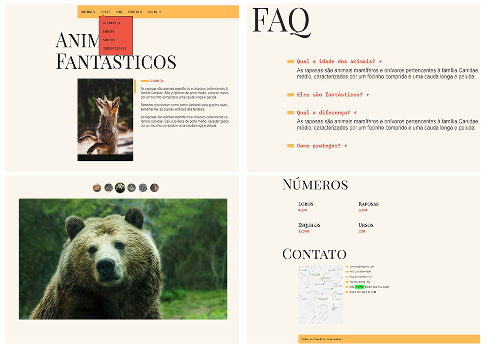

# animais-fantasticos
🐺 Projeto desenvolvido atráves do curso "JavaScript Completo ES6" da Origamid.

<h1 align="center">
    
</h1>

<h1 align="center">
    
</h1>

<h4 align="center"> 
	🚧 Animais Fantasticos 🐺 em construção... 🚧
</h4>

## 💻 Sobre o projeto

Projeto desenvolvido atráves do curso "JavaScript Completo ES6" da Origamid.

O curso vai do básico ao avançado e ao final dele será adiqurido uma compreensão total da linguagem, dos seus principais métodos e da sua sintaxe.

O foco é no aprendizado da linguagem, mas o principal local de aplicação será na web, através de manipulações do DOM e requisições via Fetch API.

Projeto sem fins lucrativos, usado apenas para estudo e prática.

Todo conteúdo pertence à Origamid (https://www.origamid.com)

## 🛠 Tecnologias

As seguintes ferramentas foram usadas na construção do projeto:

- JacaScript Completo ES6+
  - var, const, let
  - class
  - async
  - await
  - fetch
  - promise e mais
- JacaScript iniciante
  - dados
  - variaveis
  - operadores
  - boolean
  - funçoes
  - objetos
  - loops
- Objetos
  - constructor function
  - prototype
  - string
  - array
  - math
  - number
  - function
- Efeitos no DOM
  - modules
  - event bubble
  - setTimeout
  - forms
- JavaScript Asíncrono
  - promises
  - feth
  - json
  - api
  - https
  - async / await
  - api
- Classes
  - class
  - constructor
  - get
  - set
  - extends

- [HTML]
- [CSS]
- [Javascript]
